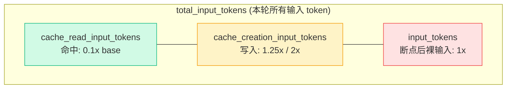

# 01 · 三个 usage 字段：官方定义、恒等式与常见误读

## TL;DR

- Anthropic 在 *Tracking cache performance* 一节给出 `cache_creation_input_tokens` / `cache_read_input_tokens` / `input_tokens` 三个 usage 字段，每个字段含义是**严格不重叠**的桶。
- 恒等式：`total_input_tokens = cache_read_input_tokens + cache_creation_input_tokens + input_tokens`。
- `input_tokens` **不是**"本轮新增内容的 token 数"，它是"最后一个 cache_control 断点之后到 prompt 末尾的全部内容"——这是大多数人误读的源头。
- 写入桶 `cache_creation_input_tokens` 一旦该轮命中（已有完全一致的前缀缓存），会变成 0；只有真正写入新缓存条目时才非 0。
- 命中桶 `cache_read_input_tokens` 在稳态命中链不断的情况下，会随着对话长度增长而单调增长。

## 官方定义（原文引用）

> `cache_creation_input_tokens`: Number of tokens written to the cache when creating a new entry.
>
> `cache_read_input_tokens`: Number of tokens retrieved from the cache for this request.
>
> `input_tokens`: Number of input tokens which were not read from or used to create a cache (that is, tokens after the last cache breakpoint).
>
> —— Anthropic 官方文档原文，docs.claude.com/en/docs/build-with-claude/prompt-caching · *Tracking cache performance* / *Understanding the token breakdown*

## 恒等式

```
total_input_tokens
  = cache_read_input_tokens     // 命中桶：本轮从缓存读出
  + cache_creation_input_tokens // 写入桶：本轮新写入
  + input_tokens                // 裸输入桶：最后一个断点之后
```

三个桶**互斥**，加起来就是模型本轮真实计费的"输入 token 总量"，无重复计数。

## 三个桶的边界图（mermaid）



## 反复出现的 4 个误读

### 误读 1：`input_tokens` = 本轮新增 user 消息的 token 数

**错。** 它是 prompt 渲染后**最后一个 cache_control 之后**的全部 token，不论这些 token 来自哪一轮。

如果你把 cache_control 打在 messages 最末一轮上，`input_tokens` 就只剩 chat-template 收尾结构 token（详见 [02-the-1-vs-6-mystery.md](./02-the-1-vs-6-mystery.md)）；如果一个断点都不打，`input_tokens` 等于 prompt 总长。

### 误读 2：`cache_creation_input_tokens` 必须每轮都为正

**错。** 只在本轮真正"延长缓存前缀"时才非 0：

| 场景 | cache_creation 是否非 0 |
|---|---|
| 首轮，前缀全新 | 是 |
| 续轮，本轮没有比上轮多出可缓存的稳定前缀 | **0**（典型纯 tool 循环） |
| 续轮，assistant 上轮有新文本，本轮把这个文本也圈进了断点之前 | 是（写入新增的那一段） |

### 误读 3：`cache_read_input_tokens` 是命中率指标

**部分对。** 它是"本轮命中字节数"，但要算命中率必须看 `cache_read / (cache_read + cache_creation + input_tokens)`。健康稳态下这个比例 > 90%。

### 误读 4：把 `input_tokens=1` 当作"几乎没付费"

**错。** `input_tokens` 是 1× 倍率没错，但更准确的说法是"断点之后没东西可缓存了"——这恰恰说明你的 cache_control 打在了正确位置，`cache_read` 才是真正承担本轮输入开销的桶。

## Twin builder run 真实样本对照

| 轮次 | input_tokens | cache_read | cache_creation | 解读 |
|---|---|---|---|---|
| 1 | 6 | 54838 | 10037 | 首轮：54838 命中（来自更早的相同前缀，例如全局 tools/system 已被另一个并行 run 写入过）+ 10037 写入新条目 + 6 个断点后结构 token |
| 2 | 1 | 66288 | 0 | 纯 tool 循环：cache 已经覆盖到本轮 prompt 的所有可缓存部分，没有新写入，只剩 1 个断点后结构 token |
| 5 | 6 | 67790 | ~ | 含文本轮：assistant 上轮说话了，本轮断点后多了 5 个 token（文本尾边界 + eot + 新 user 包装 + assistant 启动符） |
| 22 | 1 | 85875 | 0 | 稳态：cache_read 从 66288 单调涨到 85875（约 19500 个 token 在 21 轮里被加进缓存链），写入桶为 0 说明这 21 轮都是"只读不写" |

## 本章衔接

`input_tokens` 严格只是断点后的内容；那么"为什么这个值永远是 1 或 6"就完全不再是 tokens 问题，而是"chat-template 在断点后留了几个结构 token"的问题——下一章 [02-the-1-vs-6-mystery.md](./02-the-1-vs-6-mystery.md) 给出逐字节级拆解。
