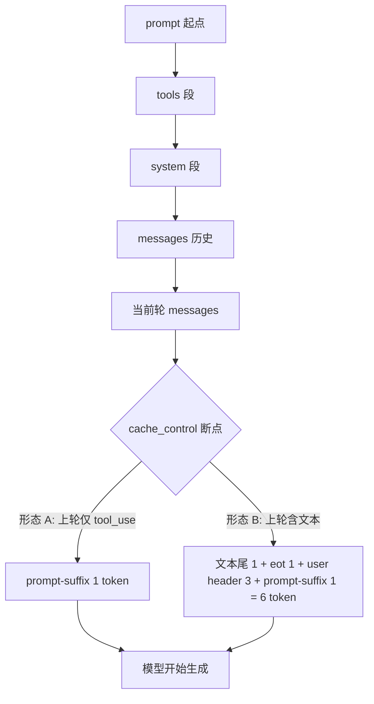

# 02 · 为什么 input_tokens 永远是 1 或 6 — chat-template 结构 token 拆解

## TL;DR

- `input_tokens` 只是"最后一个 cache_control 断点之后到 prompt 末尾的全部内容"。当断点打在每轮 messages 末尾时，断点后剩下的就**全部是 chat-template 注入的结构 token**。
- 这些结构 token 在不同轮次形态下只有两种离散组合：纯 tool 循环 = **1**，含 assistant 文本的轮次 = **6**。这不是 content 长度的连续函数。
- 物理下限是 **1**，不可能为 0。最少必须留下"让 assistant 启动下一轮的 prompt-suffix"。
- 如果你的 production 服务里 `input_tokens` 突然不等于 1 或 6，立刻去看：你是不是改动了断点位置、是不是塞了 user 文本/工具结果在断点之后、是不是模型版本切到了不同 chat-template。

## 背景：Anthropic 服务端在做什么

Anthropic 服务端把 `messages` 数组渲染成连续文本时，会注入 chat-template 结构 token，主要包括三类：

| 结构 token | 大致 token 数 | 作用 |
|---|---|---|
| role header `<|start_header_id|>{role}<|end_header_id|>` | 约 **3** | 标记一段消息属于哪个 role（user / assistant / tool） |
| end-of-turn `<|eot_id|>` | 约 **1** | 一段消息结束的边界 |
| prompt-suffix `<|start_header_id|>assistant<|end_header_id|>` | 约 **1-3** | 让 assistant 接龙的"启动符"，模型从这里开始生成 |

> 注：上面这些 token 名是开源 Llama-style chat-template 的标准记号，Anthropic 内部 chat-template 实现细节不公开，但**结构 token 的总数与轮次形态的对应关系**可以通过对照真实 usage 字段反推得到（见下方 Perplexity 实测交叉验证表）。

## 断点打在哪：决定了 input_tokens 长什么样

工程上常见的、也是 Twin builder 采用的打法：

```
[tools (cache_control:1)]
[system (cache_control:2)]
[messages[0..N-2]              ]  # 历史轮次
[messages[N-1] (cache_control:3 或 4 打在最近一轮的 user/tool_result block 末尾)]
                                ←  最后一个断点的位置
[chat-template 收尾结构 token]   ← input_tokens 只剩这部分
```

也就是说：**断点之后唯一剩下的就是 chat-template 的结构 token。** content 不再参与 `input_tokens` 计算。

## 形态 A：input_tokens = 1（纯 tool 循环）

上一轮 assistant 只调了 tool，没有任何 user-visible 文本。本轮 user 消息体只有 `tool_result` 内容（且 `tool_result` 整体被打进了断点之前）。

逐 token 拆解（从断点位置到 prompt 末尾）：

| 位置 | 内容 | token 数 |
|---|---|---|
| 断点 | （断点本身不消耗 token） | 0 |
| → 末尾 | prompt-suffix `<|start_header_id|>assistant<|end_header_id|>` 的最小压缩形态 | **1** |

合计：**1**。这就是物理下限。

## 形态 B：input_tokens = 6（含 assistant 文本的轮次）

上一轮 assistant 既说了 user-visible 文本又调了 tool（或仅说了文本）。本轮的 prompt 渲染时，上一轮的 assistant 文本必须出现在 prompt 中，并且文本之后还要插入：文本尾边界 + eot + 新 user 包装 + assistant 启动符。

| 位置 | 内容 | token 数（约） |
|---|---|---|
| 断点 | （断点本身不消耗 token） | 0 |
| → | assistant 文本的尾边界 / 闭合 token | 1 |
| → | end-of-turn `<|eot_id|>` | 1 |
| → | 新一轮的 user role header `<|start_header_id|>user<|end_header_id|>` | 3 |
| → | 末尾 prompt-suffix `<|start_header_id|>assistant<|end_header_id|>` | 1 |

合计：**6**。

## 形态对照表

| 轮次形态 | 上一轮 assistant 行为 | 断点之后插入的 chat-template 内容 | input_tokens |
|---|---|---|---|
| 纯 tool 循环 | 仅 tool_use（无文本） | 仅 prompt-suffix | **1** |
| 含文本轮 | tool_use + 文本 / 仅文本 | 文本尾边界 + eot + user header + prompt-suffix | **6** |
| 没打任何断点 | 任意 | prompt 全部内容 | 远远大于 6 |
| 断点打在中间 | 任意 | 断点到末尾的全部 content | 与 content 长度成正比 |

> 关键洞察：1 和 6 不是连续的，它们是**两种离散的 chat-template 形态**。如果你看到 `input_tokens = 3 / 5 / 12 / 50`，那一定意味着断点位置发生了变化，或是 chat-template 实现升级了。

## Twin builder run 22 轮观察对应（中文叙述 + 表）

| 轮次 | input_tokens | 上轮 assistant 行为 | 形态判断 |
|---|---|---|---|
| 1 | **6** | 系统首轮，等同"含 assistant 引导"形态 | 形态 B |
| 2 | **1** | 上轮仅 tool_use | 形态 A |
| 5 | **6** | 上轮 tool_use + 文本 | 形态 B |
| 8 | **6** | 上轮 tool_use + 文本 | 形态 B |
| 22 | **1** | 上轮仅 tool_use | 形态 A |

完全收敛到两种形态——这是结构 token 的强证据。

## 物理下限为什么是 1 不是 0

模型必须看到一个"现在轮到 assistant 说话了"的启动符，否则不会开始生成。这个启动符在 Llama-style chat-template 里是 `<|start_header_id|>assistant<|end_header_id|>`，**至少压缩成 1 个 token**。

> 这意味着：**任何 prompt 都不可能让 `input_tokens` 等于 0**。即便你把整段 prompt 都打进 cache_control 之内，那个 prompt-suffix 也必须落在断点之后。

## chat-template 结构图（mermaid）



## 调试技巧：怎么判断断点是否打对

如果你看到的 `input_tokens` **明显大于 6**：

1. 检查最近一条 user 消息或 tool_result 是不是漏打了 cache_control。
2. 检查模型是不是被升级，chat-template 版本变了（小概率）。
3. 检查是不是在断点之后注入了易变内容（时间戳、随机 id、debug 字段）。

如果 `input_tokens` **正好等于 1 或 6**，恭喜：你的断点位置已经收敛到最优。

## 本章衔接

知道断点位置决定 `input_tokens` 之后，下一步是怎么在 4 个 breakpoint 里把这 4 个位置精确放好——这是 [03-cache-control-mechanics.md](./03-cache-control-mechanics.md) 的内容。
