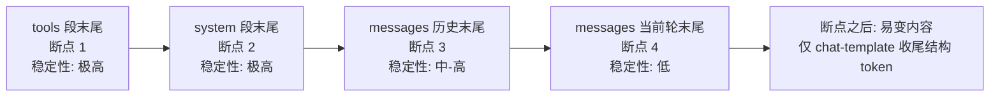
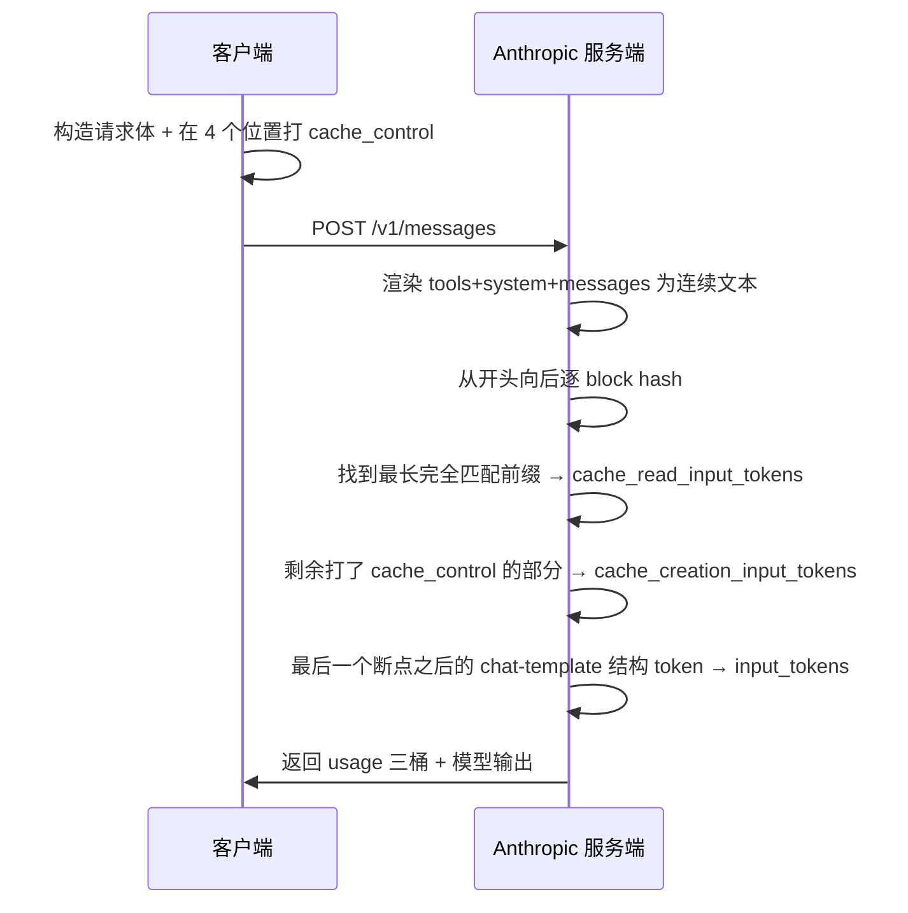

# 03 · cache_control 打标机制：4 个 breakpoint / 20 blocks lookback / TTL

## TL;DR

- `cache_control` 是 Anthropic Messages API 的请求体字段，可以加在 **`tools[*]`、`system[*]`、`messages[*].content[*]`** 任何 block 上。
- 单次请求最多 **4 个显式 breakpoint**；automatic caching 还会再隐式占 1 个 slot（合计 5）。
- lookback window = **20 blocks**——超过 20 个 block 远的内容不参与命中查找。
- 命中条件是**前缀完全相同的 hash 匹配**；tools / system / messages 任何早期内容变了，整条命中链断开。
- 顺序固定：**tools → system → messages**。命中查找从 tools 开始向后延伸，遇到第一个变化点即停止。
- TTL 默认 **5 分钟 ephemeral**，每次命中刷新（不收费）；显式声明 `"ttl": "1h"` 切到 1 小时窗口（写入更贵）。

## cache_control 在 JSON 里长什么样

最常见形态：

```jsonc
{
  "model": "claude-opus-4-7",
  "max_tokens": 4096,
  "system": [
    { "type": "text", "text": "You are a helpful assistant ..." ,
      "cache_control": { "type": "ephemeral" } }            // 断点 1
  ],
  "tools": [
    { "name": "search", "input_schema": { /* ... */ } ,
      "cache_control": { "type": "ephemeral" } }            // 断点 2（tools 段最后一个 tool 上）
  ],
  "messages": [
    { "role": "user",
      "content": [
        { "type": "text", "text": "历史对话 ...",
          "cache_control": { "type": "ephemeral" } }         // 断点 3
      ] },
    { "role": "assistant", "content": [ /* ... */ ] },
    { "role": "user",
      "content": [
        { "type": "tool_result", "tool_use_id": "...", "content": "...",
          "cache_control": { "type": "ephemeral" } }         // 断点 4（最近一轮）
      ] }
  ]
}
```

> **关键约束**：cache_control 必须挂在 *content block* 上（不是直接挂在 message 对象上），并且是 **每个段最后一个想被缓存的 block**——它的语义是"截至此 block 为止的所有前缀都被打包成一个 cache 条目"。

## 4 个显式 breakpoint 的最佳放置策略

按"稳定性递减"从前向后打：



| 断点 | 位置 | 用途 |
|---|---|---|
| 1 | tools 段最后一个 tool 上 | 锁定全部 tool 定义（每次请求都不变） |
| 2 | system 段最后一个 text block 上 | 锁定 system prompt（持久 builder 标签、persona） |
| 3 | messages 历史末尾的稳定 block 上 | 历史对话整体缓存，只有新一轮加进来才动 |
| 4 | 当前轮 user/tool_result 末尾 | 锁定本轮所有可缓存内容，让 input_tokens 收敛到 1 或 6 |

## automatic caching 的隐式 slot

> Anthropic 服务端在你**没显式声明 cache_control** 时，会按一定启发式自动把"足够长且稳定的前缀"插入隐式断点。这条隐式 slot 不计入你的 4 个显式额度，但**会出现在 cache_creation / cache_read 计费里**。

实操含义：

- 即使你完全不打 cache_control，长 prompt 也可能享受到一定缓存红利。
- 但 automatic caching 的位置选择不可控，**生产环境必须显式打标**。

## 20 blocks lookback window

> 缓存查找只回溯最近 20 个 block；超过 20 个 block 远的修改不影响命中（因为那部分早就在已缓存的前缀里）。

含义：

- 你不需要担心几百轮历史让 lookback 失效，因为命中是按"前缀 hash"做的，不是"逐 block 比较"。
- lookback window 限制的是 **breakpoint 的回溯距离**，不是 cache 条目的总长度。

## 命中匹配的物理细节

> 缓存匹配是"前缀完全相同"级别——tools/system/messages 任何早期内容变了，整条命中链断开。

举例：

```
请求 A:  tools=[T1,T2,T3]  system=[S1,S2]  messages=[M1,M2,M3]
请求 B:  tools=[T1,T2,T3]  system=[S1,S2]  messages=[M1,M2',M3]   // M2 微改
                                                  ↑ 这里开始整条断
```

请求 B 即使 `tools` / `system` / `M1` 完全一致，也只能命中到 M1 末尾；M2 之后全部需要重写。

## 为什么顺序是 tools → system → messages

Anthropic 服务端把请求渲染成一段连续文本 = `tools_text + system_text + messages_text`。命中查找是从这段连续文本的**开头**开始向后延伸，遇到第一个不一致就停。

这意味着：**最容易变化的内容必须放在最后**。把动态内容放在 system 里，会把整个 messages 段的命中机会全部毁掉。

## TTL：5m ephemeral vs 1h

| 选项 | 写入倍率 | 命中倍率 | 说明 |
|---|---|---|---|
| 默认 5m ephemeral（`"type": "ephemeral"`） | 1.25× | 0.1× | 每次命中刷新 5 分钟（不收费） |
| 1h（`"type": "ephemeral", "ttl": "1h"`） | **2×** | 0.1× | 写入更贵，长间隔工作流更划算 |

> cache_creation 对象同时给两个桶：`ephemeral_5m_input_tokens` + `ephemeral_1h_input_tokens`。这俩字段可以同时非 0（同一请求里既有 5m 断点也有 1h 断点）。

何时升级到 1h：

- 用户对话间隔 > 5 分钟、< 1 小时（例如一个工单系统、一个晚上回复一次的客服）。
- 一份 system prompt 在多个 worker 之间共享，每个 worker 的请求间隔不固定。

## 命中流程图（mermaid）



## 何时缓存不生效（即使打了标）

| 现象 | 原因 |
|---|---|
| `cache_creation = 0` 且 `cache_read = 0` 且 `input_tokens` 等于 prompt 全长 | 单段内容低于模型最小缓存阈值（见 [04-min-cache-length-trap.md](./04-min-cache-length-trap.md)） |
| `cache_creation` 每轮都很大、`cache_read` 一直为 0 | 早期内容（tools / system）每轮都有变化（含时间戳、含随机 id） |
| `cache_read` 突然清零 | TTL 过期（5m 没人请求过这个 prefix） |
| `input_tokens` 远大于 6 | 断点位置漏打了，或断点之后塞了用户输入 |

## 本章衔接

打标位置和数量都正确，但有一类静默失败你看不到任何错误信号——**单段内容低于模型最小缓存阈值**。下一章 [04-min-cache-length-trap.md](./04-min-cache-length-trap.md) 给出按模型分级表和 debug 方法。
