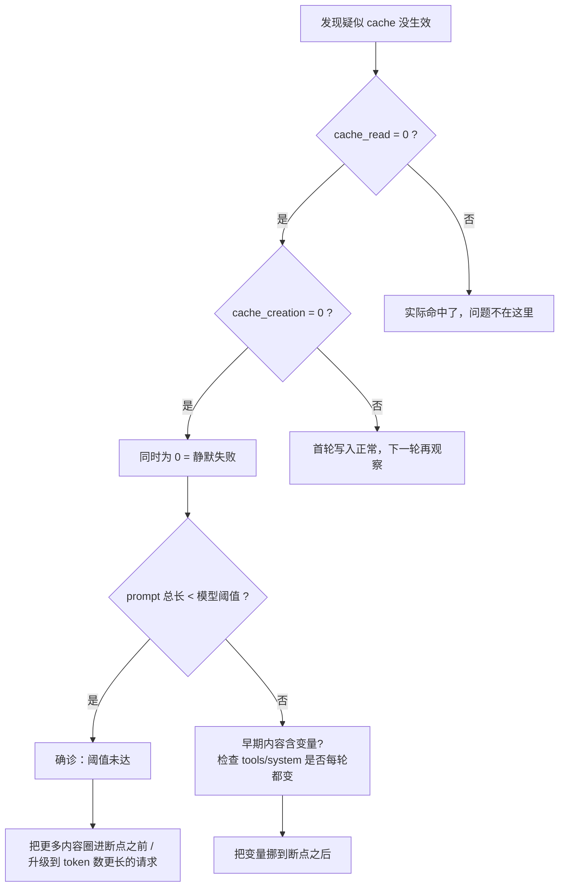

# 04 · 最小可缓存长度陷阱：按模型分级 + 静默失败的定位方法

## TL;DR

- Anthropic 对每个 Claude 模型设置了**最小可缓存长度**：单段被打了 `cache_control` 的内容如果低于阈值，**会被静默忽略，缓存不生效，也不会报错**。
- Opus 4.7 / Opus 4.6 / Opus 4.5 / Mythos Preview / Haiku 4.5 阈值是 **4096 tokens**——这是最容易踩坑的地方，因为很多人按 1024 默认值写代码。
- Sonnet 4.5 / Opus 4.1 / Opus 4 / Sonnet 4 / Sonnet 3.7 阈值是 **1024 tokens**。
- Sonnet 4.6 / Haiku 3.5 阈值是 **2048 tokens**。
- **debug 信号**：cache_creation 和 cache_read 同时为 0，且 input_tokens 等于 prompt 全长 → 几乎可以确定是阈值未达。

## 官方阈值对照表

> Anthropic 官方文档原文，docs.claude.com/en/docs/build-with-claude/prompt-caching · *Cache limitations* / minimum cacheable prompt length 一节。

| 模型 | 最小可缓存长度（tokens） |
|---|---|
| Claude Mythos Preview | **4096** |
| **Claude Opus 4.7** | **4096** |
| Claude Opus 4.6 | **4096** |
| Claude Opus 4.5 | **4096** |
| Claude Sonnet 4.6 | 2048 |
| Claude Sonnet 4.5 | 1024 |
| Claude Opus 4.1 | 1024 |
| Claude Opus 4 | 1024 |
| Claude Sonnet 4 | 1024 |
| Claude Sonnet 3.7 | 1024 |
| Claude Haiku 4.5 | **4096** |
| Claude Haiku 3.5 | 2048 |

> **特别强调**：Opus 4.7 / 4.6 / 4.5 全部是 **4096**。如果你的 system prompt + tools 加起来不到 4096 token，再怎么打 cache_control 都不会生效。

## 阈值是怎么算的

阈值是"**单段被 cache_control 圈住的内容的 token 数**"，不是请求总 token 数。

举例（Opus 4.7，阈值 4096）：

| 配置 | 是否触发缓存 |
|---|---|
| `tools` 段 1500 token + cache_control，`system` 段 800 token + cache_control | **不触发**（两段都低于 4096） |
| `tools` 段 1500 + `system` 段 800 + 把 cache_control 打在 system 段末尾（圈住 tools+system 共 2300） | **不触发**（圈住总量 2300 < 4096） |
| 同上，但圈住 tools+system+messages 共 5000 | **触发**（≥ 4096） |
| 单独一个 cache_control 在 tools 末尾圈 4500 token | **触发** |

**核心规则**：从请求开头到 cache_control 那个断点之间的 token 总数必须 ≥ 模型阈值。

## 静默失败的诊断决策树



## 用真实数字验证（Twin builder run）

22 轮中第 1 轮的 usage：

| 字段 | 值 |
|---|---|
| input_tokens | 6 |
| cache_read_input_tokens | 54838 |
| cache_creation_input_tokens | 10037 |

`cache_read + cache_creation = 64875 tokens`，远 ≥ 4096——所以 Opus 4.7 的最小阈值在这个工作负载里完全不成问题。这也解释了为什么 Twin builder run 的 cache 一直健康工作。

如果换成一个总 prompt 只有 3500 token 的小 demo（比如简单 chatbot），打了 cache_control 也是白打——你会看到三个字段长这样：

| 字段 | 值（演示低于阈值时） |
|---|---|
| input_tokens | 3500 |
| cache_read_input_tokens | 0 |
| cache_creation_input_tokens | 0 |

——也就是 **token 全部走了 1× 倍率的裸输入桶**。

## 怎么把不到阈值的 prompt 拉到阈值之上

按性价比排序：

1. **把 tools 全部 schema 圈进 cache**（很多人忽略 tools 段；一个完整的 tool 定义往往 200-800 token，凑齐几个就过 4096）。
2. **把 system prompt 写完整**：persona、constraints、style guide、examples 都放进去（这些本来就该在 system 里）。
3. **few-shot examples 放 system 段后部**，圈进同一个 cache_control。
4. **不要为了凑长度填废话**：模型会按 prompt 里的内容生成，废话会污染输出。

## 一行 Go 健康检查

```go
// 在每次请求收到响应后立刻调用
func assertCacheHealthy(usage Usage, model string) {
    threshold := minCacheLen(model)  // 4096 / 2048 / 1024 按模型查表
    cached := usage.CacheReadInputTokens + usage.CacheCreationInputTokens
    if cached == 0 && usage.InputTokens >= threshold {
        log.Warn("cache_control 打了但是单段内容没达阈值，请检查 prompt 结构",
            "model", model, "threshold", threshold, "input_tokens", usage.InputTokens)
    }
}
```

## 易错点：阈值检查发生在 server 端，client 完全无感

> **官方文档明确声明**：低于阈值时 server 静默忽略 cache_control，**不报错**、**不返回任何 warning header**、**不返回任何 hint 字段**。

唯一可观测信号就是 usage 三桶——所以**生产环境必须把 usage 字段写进监控**，否则你永远不会发现自己在按 1× 倍率付费。

## 本章衔接

知道了打标机制 + 阈值规则之后，下一步是看一份真实请求体长什么样、cache_control 具体打在哪几行 JSON 上——下一章 [05-real-request-anatomy.md](./05-real-request-anatomy.md) 基于 Twin builder run 重建了两份完整 POST /v1/messages 请求体。
