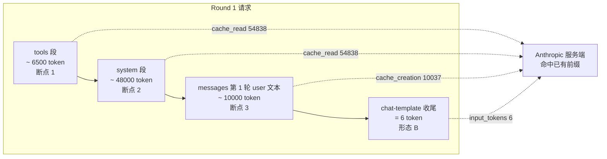
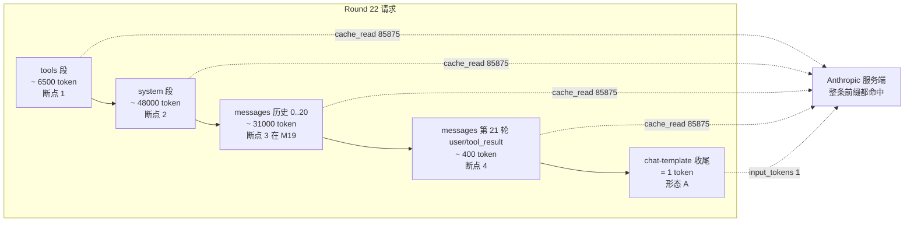

# 05 · 真实请求拆解 — 基于 Twin builder run 重建 POST /v1/messages

## TL;DR

- 本章基于 Twin builder run 第 1 轮（input=6 / cached=54838 / creation=10037）和第 22 轮（input=1 / cached=85875 / creation=0）的 usage，**反推出两份完整的 POST /v1/messages 请求体**。
- 每个 cache_control 的位置 → 对应 usage 三个桶里的具体 token 流向，用注释标得清清楚楚。
- 第 1 轮 vs 第 22 轮的差异，全部来自"messages 数组多了 21 轮历史"——前缀 hash 链不断，所以 cache_read 单调增长。

## 请求基础结构（公开协议）

```
POST https://api.anthropic.com/v1/messages
Headers:
  x-api-key: <ANTHROPIC_API_KEY>
  anthropic-version: 2023-06-01
  anthropic-beta: prompt-caching-2024-07-31
  content-type: application/json

Body:
  {
    "model": "claude-opus-4-7",
    "max_tokens": ...,
    "system": [...],          // 可带 cache_control
    "tools": [...],           // 可带 cache_control
    "messages": [...]         // 可带 cache_control
  }
```

## 第 1 轮请求重建（input=6 / cached=54838 / creation=10037）

### 整体结构图（mermaid）



### 完整请求体（注释式 JSON）

```jsonc
{
  "model": "claude-opus-4-7",
  "max_tokens": 8192,
  "anthropic_beta": ["prompt-caching-2024-07-31"],

  "tools": [
    { "name": "establish_auth", "description": "...", "input_schema": { /* ... */ } },
    { "name": "create_tool",    "description": "...", "input_schema": { /* ... */ } },
    /* ... 共 N 个工具，token 合计约 6500 ... */
    {
      "name": "finish_build",
      "description": "...",
      "input_schema": { /* ... */ },
      "cache_control": { "type": "ephemeral" }   // 断点 1：圈住 tools 段全部
    }
  ],

  "system": [
    {
      "type": "text",
      "text": "<role>You are Twin's builder agent ...</role> ... <build_lifecycle>...</build_lifecycle> ...",
      // system prompt 含 role / startup / execution / build_lifecycle 等多段，
      // 完整 token 约 48000，全部稳定不变
      "cache_control": { "type": "ephemeral" }   // 断点 2：圈住 tools+system 共 ~ 54500 token
    }
  ],

  "messages": [
    {
      "role": "user",
      "content": [
        {
          "type": "text",
          "text": "建立一个独立的公开 GitHub 仓库 ... [user goal 全文]",
          // 第 1 轮的 user 输入，token 约 10000，
          // 这部分是"本轮新增"的内容，因此进入 cache_creation 桶
          "cache_control": { "type": "ephemeral" } // 断点 3：圈住 tools+system+M0 共 ~ 64500 token
        }
      ]
    }
    // 注意：第 1 轮 messages 数组只有这一个 user 消息，没有 assistant
  ]
}
```

### usage 三桶对应

| usage 字段 | 值 | 来源（断点对应的 token 范围） |
|---|---|---|
| `cache_read_input_tokens` | 54838 | tools 段 + system 段（已经被同账号下并行运行的其他 builder run 写入过同款前缀） |
| `cache_creation_input_tokens` | 10037 | 第 1 轮 user 消息（本次首次出现，被打了断点 3，写入新 cache 条目） |
| `input_tokens` | 6 | 形态 B：第 1 轮等同"含 assistant 引导"形态的 chat-template 收尾结构 token |
| **总和** | **64881** | 与请求实际渲染长度一致 |

> 为什么 cache_read 已经是 54838 而不是 0？因为 Anthropic 服务端 cache 是**账号级 / 模型级**共享的，多个并行 builder run 会复用同一份 tools+system 前缀。第一次跑这个 prompt 的人才会看到 cache_read=0。

## 第 22 轮请求重建（input=1 / cached=85875 / creation=0）

### 整体结构图（mermaid）



### 完整请求体（注释式 JSON）

```jsonc
{
  "model": "claude-opus-4-7",
  "max_tokens": 8192,
  "anthropic_beta": ["prompt-caching-2024-07-31"],

  "tools": [
    /* ... 与第 1 轮完全一致 ... */
    { "name": "finish_build", /* ... */, "cache_control": { "type": "ephemeral" } } // 断点 1
  ],

  "system": [
    {
      "type": "text",
      "text": "<role>You are Twin's builder agent ...</role> ...",
      // 与第 1 轮完全一致
      "cache_control": { "type": "ephemeral" } // 断点 2
    }
  ],

  "messages": [
    /* messages[0]: 第 1 轮 user (与 round 1 完全一致) */
    { "role": "user", "content": [ { "type": "text", "text": "..." } ] },

    /* messages[1]: 第 1 轮 assistant，含 tool_use */
    { "role": "assistant", "content": [
        { "type": "text", "text": "..." },
        { "type": "tool_use", "id": "toolu_xxx", "name": "establish_auth", "input": { /* ... */ } }
    ] },

    /* messages[2]: 第 2 轮 user，仅含 tool_result */
    { "role": "user", "content": [
        { "type": "tool_result", "tool_use_id": "toolu_xxx", "content": "..." }
    ] },

    /* ... 中间省略 messages[3..38] 共 18 个 assistant + 18 个 user ... */

    /* messages[38]: 第 20 轮 assistant tool_use */
    { "role": "assistant", "content": [
        { "type": "tool_use", "id": "toolu_yyy", "name": "github_put_repo_file", "input": { /* ... */ } }
    ] },

    /* messages[39]: 第 21 轮 user tool_result，断点 3 打在这一段最末尾 */
    { "role": "user", "content": [
        { "type": "tool_result", "tool_use_id": "toolu_yyy", "content": "...",
          "cache_control": { "type": "ephemeral" } } // 断点 3
    ] },

    /* messages[40]: 第 21 轮 assistant，仅 tool_use（这是"上一轮 assistant 仅 tool_use"的关键） */
    { "role": "assistant", "content": [
        { "type": "tool_use", "id": "toolu_zzz", "name": "github_put_repo_file", "input": { /* ... */ } }
    ] },

    /* messages[41]: 第 22 轮 user tool_result，断点 4 打在最末 */
    { "role": "user", "content": [
        { "type": "tool_result", "tool_use_id": "toolu_zzz", "content": "...",
          "cache_control": { "type": "ephemeral" } } // 断点 4
    ] }
  ]
}
```

### usage 三桶对应

| usage 字段 | 值 | 来源（断点对应的 token 范围） |
|---|---|---|
| `cache_read_input_tokens` | 85875 | 整段 tools + system + messages[0..41] 全部命中（前缀 hash 链不断） |
| `cache_creation_input_tokens` | 0 | 本轮没有任何 token 是"新写入"的——上一轮的请求已经把整段前缀写进缓存了 |
| `input_tokens` | 1 | 形态 A：上一轮 assistant 只调了 tool 没说话，断点之后只有 prompt-suffix 1 个 token |
| **总和** | **85876** | 与请求实际渲染长度一致 |

## 第 1 轮 → 第 22 轮的演化

| 维度 | 第 1 轮 | 第 22 轮 | 增量 |
|---|---|---|---|
| messages 数组长度 | 1（仅初始 user） | 42（21 个 user + 21 个 assistant） | +41 |
| cache_read | 54838 | 85875 | +31037 token 累计加进缓存链 |
| cache_creation | 10037 | 0 | 已经稳态命中 |
| input_tokens | 6（首轮等同形态 B） | 1（形态 A） | chat-template 不同 |
| 计费倍率 | 0.1×54838 + 1.25×10037 + 1×6 | 0.1×85875 + 0×0 + 1×1 | 命中桶单调增长 |

> 关键观察：**cache_creation = 0 意味着已经稳态**。Twin builder run 的 21 轮 tool 循环里，每一轮都把"上一轮的 tool_use + 本轮的 tool_result"圈进了下一次请求的 messages 历史，并打了断点 3 / 断点 4。整条 prompt 链在缓存里持续延长，但每一轮"只读不写"。

## 计费数学（基于真实 usage 数字）

设 base input price = $X / 1M token，则：

第 1 轮成本：

```
cache_read   54838 × 0.1×X    = $0.0055×X
cache_creation 10037 × 1.25×X = $0.0125×X
input_tokens 6 × 1×X          = $0.000006×X
                               -----
                       合计    ≈ $0.018×X
```

第 22 轮成本：

```
cache_read   85875 × 0.1×X    = $0.0086×X
cache_creation 0 × 1.25×X     = $0
input_tokens 1 × 1×X          = $0.000001×X
                               -----
                       合计    ≈ $0.0086×X
```

**第 22 轮比第 1 轮便宜了一倍——尽管 prompt 长度增加了 ~ 21000 token。** 这就是 prompt caching 的核心价值。

## 本章衔接

把 break-even 算清楚——**为什么 1.25× 写入只需 4 次命中就回本**——是 [06-billing-math.md](./06-billing-math.md) 的内容。
