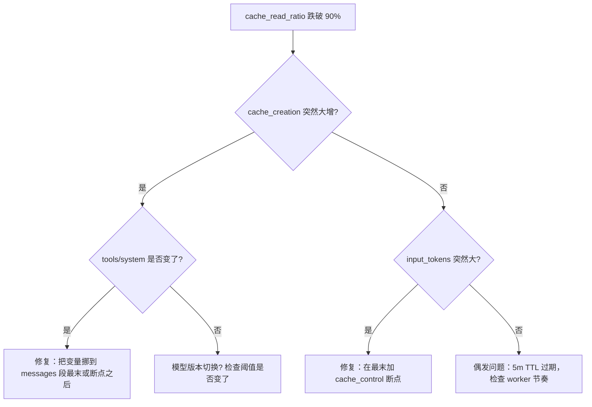

# 07 · Go 实现侧的实战清单：何时打标 / 何时不打 / 健康度自检

## TL;DR

- **必须做**：稳定 prefix（tools/system 永不带变量）、4 个 breakpoint 位置固定、易变内容（时间戳、随机 id）必须放断点之后、5 分钟内必须复用以避免 cache_creation 重复付费。
- **不能做**：用 latin1 中转 utf-8、用 `btoa()` 编码 utf-8、不打标但期待 automatic caching 的隐式 slot 能自动救场、把 messages 数组顺序乱写。
- **Health check**：每轮记录 input/cached/creation 三个数字，dashboard 看 cache_read 占比是否 > 90%。

## 必须做的硬规则

### 1. tools / system 段绝对稳定

```go
// ✅ 正确：system prompt 拼接好之后整段挂 cache_control
type SystemBlock struct {
    Type         string        `json:"type"`
    Text         string        `json:"text"`
    CacheControl *CacheControl `json:"cache_control,omitempty"`
}

req.System = []SystemBlock{
    {
        Type:         "text",
        Text:         buildSystemPrompt(persona, constraints, examples), // 完全不含时间戳
        CacheControl: &CacheControl{Type: "ephemeral"},
    },
}
```

```go
// ❌ 错误：system 里塞了 time.Now()，每轮 prompt hash 都变
req.System = []SystemBlock{
    {
        Type: "text",
        Text: fmt.Sprintf("Current time: %s\n\n%s", time.Now().Format(time.RFC3339), basePrompt),
        CacheControl: &CacheControl{Type: "ephemeral"},
    },
}
// 后果：每轮 cache_creation 都非 0，cache_read 一直为 0，永远拿不到 0.1× 折扣
```

### 2. 4 个 breakpoint 的位置固定

```go
// 推荐打法
const (
    BreakpointTools     = 1 // tools 段最后一个 tool
    BreakpointSystem    = 2 // system 段最后一个 text block
    BreakpointHistory   = 3 // messages 历史的最后一条稳定 block
    BreakpointCurrent   = 4 // 当前轮 user/tool_result 的最后一个 block
)

// 在请求构造函数里硬编码这 4 个位置，永不动态调整
```

### 3. 易变内容统一放断点之后

```go
// ✅ 正确：动态 user 输入永远放在最后一条 message 上，不打 cache_control
//        让它自然落在断点 4 的"未圈住"区域 → input_tokens 桶
req.Messages = append(req.Messages, Message{
    Role: "user",
    Content: []ContentBlock{
        {Type: "text", Text: userInput}, // 不挂 cache_control
    },
})
```

> 一个微妙细节：**实际上推荐把当前轮的 user 内容也圈进断点 4**，这样 input_tokens 收敛到 1 或 6，下一轮就能命中。但"易变内容"指的是**完全无法稳定**的字段（例如随机 trace_id、毫秒级时间戳）——这些必须放在断点之后或干脆不放进 prompt。

### 4. 5 分钟内必须复用

```go
// ✅ 正确：worker 池子里 keep-alive 复用同一份 system prompt
//        每个请求间隔保持在 < 5 分钟
type Worker struct {
    sysPromptHash string // 用 hash 标识当前 prompt 版本
    lastReqTime   time.Time
}

func (w *Worker) Send(messages []Message) {
    if time.Since(w.lastReqTime) > 4*time.Minute {
        log.Warn("距上次请求 > 4 分钟，cache 可能过期")
    }
    // ... 发送请求
    w.lastReqTime = time.Now()
}
```

如果业务节奏天然 > 5 分钟一次：升级到 1h cache 选项（写入 2×、命中 0.1×、break-even 在第 3 次）。

## 不能做的硬规则

### 1. 不要用 latin1 中转 utf-8

```go
// ❌ 错误：把 utf-8 字节按 latin1 解释 → base64 → 发出去
//   常见于 Node.js Buffer 错用，Go 里不会写错但要警惕和 JS 互通时的接口
str := string(utf8Bytes)             // OK
encoded := base64.StdEncoding.EncodeToString([]byte(str)) // OK，因为 Go string = bytes

// ❌ JS 里的反例（绝对禁止）：
// btoa(unescape(encodeURIComponent(str)))   // 看似 utf-8 实际全坏
// Buffer.from(str, 'latin1').toString('base64')  // 中文字符全部破损
```

### 2. 不要用 `btoa()` 编码 utf-8

```js
// ❌ 错误：btoa() 只接受 latin1，遇到中文直接抛 InvalidCharacterError
btoa('你好')  // 抛错

// ✅ 正确（Node.js）：
Buffer.from('你好', 'utf8').toString('base64')

// ✅ 正确（浏览器原生）：
//   先转 utf-8 字节序列再 btoa
btoa(String.fromCharCode(...new TextEncoder().encode('你好')))
```

> 在 Twin 这种 agent 工程里，把中文 markdown PUT 上 GitHub 时**必须**用 `Buffer.from(str, 'utf8').toString('base64')`，否则 GitHub 回读时所有中文字符会变成 mojibake（且 hash 变化让 cache 命中失效）。

### 3. 不要靠 automatic caching 自动救场

> Anthropic 的 automatic caching 隐式 slot **位置不可控**，生产环境**必须显式打 cache_control**。

```go
// ❌ 错误：什么都不打，期待 server 自动选位置
req.System = []SystemBlock{ {Type: "text", Text: longSystemPrompt} } // 没挂 cache_control

// ✅ 正确：显式声明
req.System = []SystemBlock{ {Type: "text", Text: longSystemPrompt, CacheControl: &CacheControl{Type: "ephemeral"}} }
```

automatic caching 适合 demo 和 prototype；生产环境必须把命中点钉死。

### 4. 不要把 messages 数组顺序乱写

```go
// ❌ 错误：messages 不是按时间顺序追加，而是按某种业务逻辑乱排
req.Messages = []Message{
    historyTurns[5], // 第 6 轮
    historyTurns[2], // 第 3 轮  
    historyTurns[7], // 第 8 轮 ← 乱序
}
// 后果：每次顺序都可能不同 → 前缀 hash 变 → cache 永远命中不上
```

```go
// ✅ 正确：严格按时间顺序追加
req.Messages = make([]Message, 0, len(history)+1)
for _, turn := range history { req.Messages = append(req.Messages, turn) }
req.Messages = append(req.Messages, currentTurn)
```

## Go 接口骨架

```go
package anthropic

type CacheControl struct {
    Type string `json:"type"`           // "ephemeral"
    TTL  string `json:"ttl,omitempty"`  // "5m"（默认）/ "1h"
}

type ContentBlock struct {
    Type         string        `json:"type"`            // "text" / "tool_use" / "tool_result"
    Text         string        `json:"text,omitempty"`
    ToolUseID    string        `json:"tool_use_id,omitempty"`
    Content      string        `json:"content,omitempty"`
    CacheControl *CacheControl `json:"cache_control,omitempty"`
}

type Message struct {
    Role    string         `json:"role"`
    Content []ContentBlock `json:"content"`
}

type Tool struct {
    Name         string         `json:"name"`
    Description  string         `json:"description"`
    InputSchema  map[string]any `json:"input_schema"`
    CacheControl *CacheControl  `json:"cache_control,omitempty"`
}

type SystemBlock struct {
    Type         string        `json:"type"`
    Text         string        `json:"text"`
    CacheControl *CacheControl `json:"cache_control,omitempty"`
}

type Request struct {
    Model     string        `json:"model"`
    MaxTokens int           `json:"max_tokens"`
    System    []SystemBlock `json:"system"`
    Tools     []Tool        `json:"tools"`
    Messages  []Message     `json:"messages"`
}

type Usage struct {
    InputTokens               int `json:"input_tokens"`
    OutputTokens              int `json:"output_tokens"`
    CacheReadInputTokens      int `json:"cache_read_input_tokens"`
    CacheCreationInputTokens  int `json:"cache_creation_input_tokens"`
}
```

## Health check：每轮自检

```go
type CacheStats struct {
    CacheReadRatio   float64 // cache_read / total_input
    CacheWriteRatio  float64 // cache_creation / total_input
    InputBypassRatio float64 // input_tokens / total_input
}

func ComputeStats(u Usage) CacheStats {
    total := u.InputTokens + u.CacheReadInputTokens + u.CacheCreationInputTokens
    if total == 0 { return CacheStats{} }
    return CacheStats{
        CacheReadRatio:   float64(u.CacheReadInputTokens) / float64(total),
        CacheWriteRatio:  float64(u.CacheCreationInputTokens) / float64(total),
        InputBypassRatio: float64(u.InputTokens) / float64(total),
    }
}

func AssertHealthy(s CacheStats, model string) error {
    if s.CacheReadRatio < 0.90 {
        return fmt.Errorf("cache_read 占比 %.2f%% < 90%%，prompt 可能含变量或断点漏打", s.CacheReadRatio*100)
    }
    return nil
}
```

## Dashboard 关键字段

把以下 6 个数字写进 metrics（每轮一行）：

| 字段 | 类型 | 用途 |
|---|---|---|
| `model` | label | 区分阈值（4096 / 2048 / 1024） |
| `total_input_tokens` | counter | prompt 总长趋势 |
| `cache_read_input_tokens` | counter | 命中量趋势 |
| `cache_creation_input_tokens` | counter | 写入量趋势（应该几乎为 0） |
| `input_tokens` | gauge | 应该收敛到 1 或 6 |
| `cache_read_ratio` | gauge | 主指标，目标 > 90% |

## 排错决策树



## 本章衔接

工程清单到此为止。剩下的三个 samples 文件分别给出：
- [samples/request-template.json](./samples/request-template.json)：可直接发送的请求体模板
- [samples/response-usage-examples.json](./samples/response-usage-examples.json)：4 种典型 usage 形态
- [samples/cache-debug-checklist.md](./samples/cache-debug-checklist.md)：cache 异常 debug 决策树
