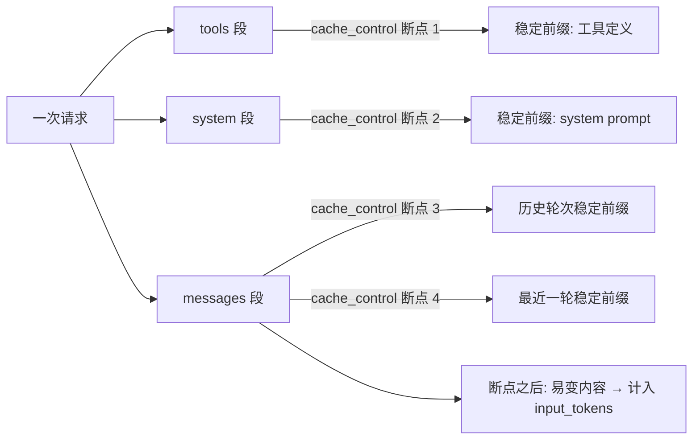

# anthropic-prompt-caching-deep-dive

> 一份基于 Twin builder run（claude-opus-4-7 + builder_v3）真实 `usage` 字段、对照 Anthropic 官方文档逐条反推的 prompt caching 实战手册。

## TL;DR（一页速读）

1. `total_input_tokens = cache_read_input_tokens + cache_creation_input_tokens + input_tokens`，三者互不重叠。`input_tokens` 严格只包含 **最后一个 cache_control 断点之后** 的内容。
2. 观察到的 `input_tokens ∈ {1, 6}` **不是** content 长度的连续函数，而是 chat-template 结构 token 的两种离散形态：纯 tool 循环 = 1，含 assistant 文本的轮次 = 6。物理下限是 1（必须有让 assistant 启动的 prompt-suffix），不可能为 0。
3. 最多 **4 个** 显式 `cache_control` 断点；automatic caching 再隐式占 1 个 slot；lookback window = **20 blocks**。
4. **最小可缓存长度按模型分级**——Opus 4.7 / 4.6 / 4.5 / Mythos Preview 是 **4096 tokens**，不是默认想象的 1024。打标但低于阈值 → 静默不缓存，**不报错**。
5. 计费倍率：5m 写入 `1.25× base input`，1h 写入 `2× base input`，命中 `0.1× base input`。**5m 写入 4 次命中即可回本。**

## 5 张速查表

### 表 1：三个 usage 字段

| 字段 | 含义 | 计费倍率（相对 base input） |
|---|---|---|
| `cache_creation_input_tokens` | 写入缓存的 token | 1.25×（5m）/ 2×（1h） |
| `cache_read_input_tokens` | 命中缓存的 token | 0.1× |
| `input_tokens` | 最后一个断点之后到 prompt 末尾的内容 | 1× |

### 表 2：input_tokens 的两种离散值

| 形态 | 上一轮 assistant 行为 | input_tokens |
|---|---|---|
| 纯 tool 循环 | 仅 tool_use（无文本） | **1** |
| 含文本轮 | tool_use + 文本（或仅文本） | **6** |

### 表 3：最小缓存长度（按模型）

| 模型 | 最小缓存长度（tokens） |
|---|---|
| Claude Mythos Preview / Opus 4.7 / Opus 4.6 / Opus 4.5 | **4096** |
| Sonnet 4.6 | 2048 |
| Sonnet 4.5 / Opus 4.1 / Opus 4 / Sonnet 4 / Sonnet 3.7 | 1024 |
| Haiku 4.5 | 4096 |
| Haiku 3.5 | 2048 |

### 表 4：cache_control 限制

| 项目 | 限制 |
|---|---|
| 显式 breakpoints | 最多 4 个 |
| automatic caching slot | 隐式占 1 个 |
| lookback window | 20 blocks |
| 顺序 | tools → system → messages |
| 命中条件 | 完整前缀 hash 一致（任何早期内容变动都断链） |

### 表 5：TTL 与计费倍率

| TTL | 写入倍率 | 命中倍率 | 默认 |
|---|---|---|---|
| 5m ephemeral | 1.25× | 0.1× | ✅ |
| 1h | 2× | 0.1× | 需显式声明 |

## 目录导航

| 文件 | 主题 |
|---|---|
| [01-three-fields-explained.md](./01-three-fields-explained.md) | 三个 usage 字段官方定义 + 恒等式 + 常见误读 |
| [02-the-1-vs-6-mystery.md](./02-the-1-vs-6-mystery.md) | 为什么 input_tokens 永远是 1 或 6（chat-template 拆解） |
| [03-cache-control-mechanics.md](./03-cache-control-mechanics.md) | 打标机制：4 个 breakpoint / 20 blocks lookback / TTL |
| [04-min-cache-length-trap.md](./04-min-cache-length-trap.md) | 最小缓存长度陷阱（按模型分级 + 静默失败 debug） |
| [05-real-request-anatomy.md](./05-real-request-anatomy.md) | 真实请求拆解：基于 Twin builder run 重建 POST /v1/messages |
| [06-billing-math.md](./06-billing-math.md) | 计费数学：1.25× / 2× / 0.1× 与 break-even |
| [07-go-engineering-checklist.md](./07-go-engineering-checklist.md) | Go 实现侧实战清单 + 健康度自检 |
| [samples/request-template.json](./samples/request-template.json) | 完整请求体模板（4 个 cache_control 断点） |
| [samples/response-usage-examples.json](./samples/response-usage-examples.json) | 多种 usage 形态的 JSON 样本 |
| [samples/cache-debug-checklist.md](./samples/cache-debug-checklist.md) | cache 异常 debug 决策树 |

## 整体结构图

## 适用范围

- 调用 `POST https://api.anthropic.com/v1/messages` 的 Claude 模型用户
- 长 prompt（system / tools 占大头）+ 多轮 tool 循环（Twin / agent loop / Builder pattern）
- 工程团队需要明确"为什么 cache 没生效"的 debug 路径

## 参考资料

- Anthropic 官方文档 docs.claude.com/en/docs/build-with-claude/prompt-caching（*Tracking cache performance* / *Understanding the token breakdown*）
- Anthropic Messages API 协议 `POST /v1/messages`，header `anthropic-version: 2023-06-01`、`anthropic-beta: prompt-caching-2024-07-31`
- Twin builder run 真实观察数据（claude-opus-4-7 + builder_v3，22 轮 PolicyDecided）
